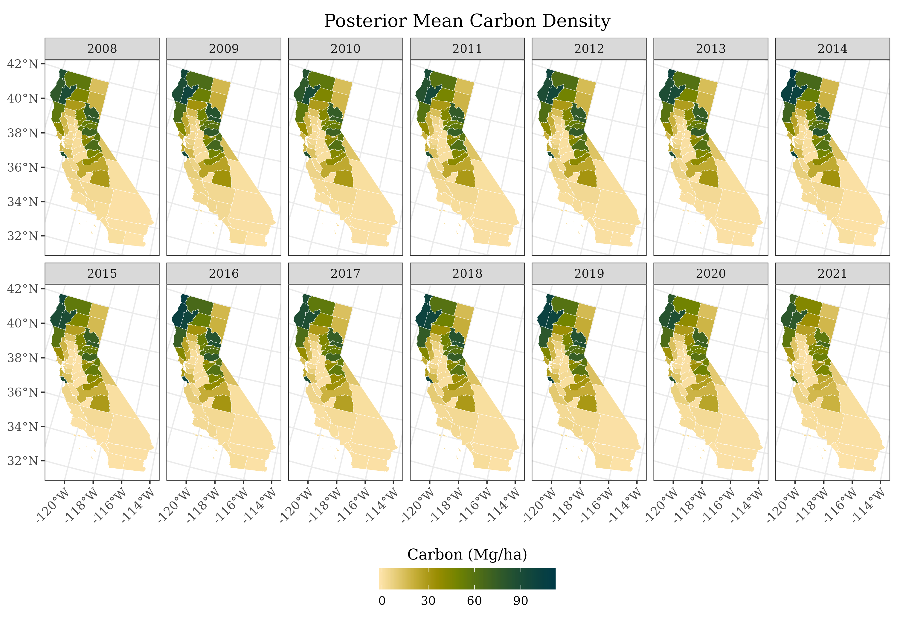

# Bayesian Spatio-Temporal SAE Visualization

This repository contains code to run a **Bayesian Spatio-Temporal Small Area Estimation (SAE)** model and generate visualizations. The model example estimates county-level carbon density over time (2008–2021) for California, incorporating spatial/temporal structure and quantifying uncertainty. See the [arXiv Preprint](https://doi.org/10.48550/arXiv.2503.08653) for more details. 



## 📁 Project Structure

```
├── data.rds # Model data
├── samples.rds # Posterior samples from model
├── generate_figures.R # Main script to produce figures
├── mod.R # Data preparation and MCMC setup
├── sampler.cpp # C++ sampler code (via Rcpp)
├── figs/ # Output figures
│ ├── svc.png # Space-varying coefficient map
│ ├── mu_mean.png # Posterior mean of carbon density
│ ├── mu_sd.png # Posterior SD of carbon density
| ├── u.png # Spatio-temporal intercept map
│ ├── trend.png # Carbon trend map
│ ├── sig_trend.png # Significant trend map
│ └── counties/ # County-level comparison plots
└── README.md # Project documentation
```

## 🔧 Code

### `mod.R`

- Prepares model components:
  - Design matrices
  - Spatial structure
- Sets up priors and model settings
- Calls the custom C++ sampler (`sampler.cpp`)
- Saves posterior samples to `samples.rds`

### `sampler.cpp`

- C++ implementation of the MCMC sampler using **Rcpp** and **RcppArmadillo** 
- Efficient sampling of:
  - Random effects
  - Variance terms
  - Hyperparameters
- Must be compiled via `Rcpp::sourceCpp("sampler.cpp")`

### `figures.R`

- Loads posterior samples and shapefiles
- Computes posterior summaries
- Produces:
  - Spatial maps (mean, SD, trends)
  - County-level comparison plots (model vs direct estimates)


## 📦 Requirements

### R packages:

```r
install.packages(c("sf", "ggplot2", "dplyr", "stringr", "scico", "ggnewscale", "Rcpp", "RcppArmadillo", "Matrix"))
```

## 📬 Contact

- **Author**: Elliot S. Shannon
- **Email**: shann125@msu.edu
- **Affiliation**: Michigan State University